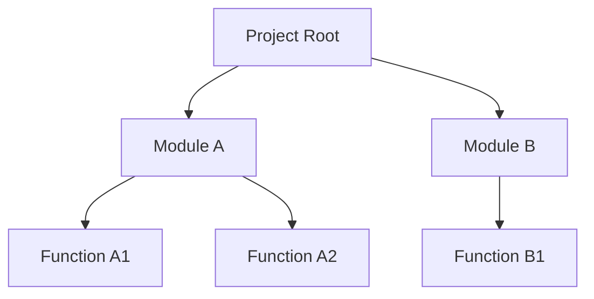
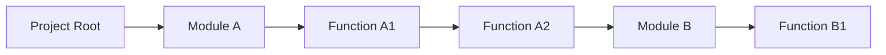

# Conversation Tree

**Conversation Tree** uses LLMs to facilitate tree-like conversations for top-down hierarchical project structuring.

This tool allows users to branch conversations out into multiple threads while maintaining the context window, aiding in the iterative development of project components.

## Motivation

### Hierarchical Project Planning
Many systems exhibit a hierarchical structure designed in layers. For example, a programing project could have several modules, with each module containing several functions. This makes iterative hierarchical project planning more natural than linear project planning.



### Recency Bias
LLMs exhibit a [recency bias](https://arxiv.org/abs/2406.15981) within their context windows. They tend to prioritize information presented at the end of the input sequence over earlier content. When a hierarchical conversation structure is flattened to a linear structure in a preorder traversal, the root prompt at the beginning of the input has lower information priority, even though it is close to the beginning prompt in the tree.

### Alternatives
ChatGPT's edit feature can mimic a tree-like conversation by strategically editing queries. However, this only keeps your current branch in the context window. This means that chatgpt is unaware of the other components in the project.

## Features
- Supports branching conversations for hierarchical project planning.
- Keeps the entire conversation tree within the context window.

## Prerequisites
Before using this project, ensure you have:
- The [uv package manger](https://docs.astral.sh/uv/getting-started/installation/).
- An [openai api key](https://platform.openai.com/api-keys).

## Setup

### 1. Clone the Repository
```bash
git clone https://github.com/KennethJAllen/conversation-tree
cd conversation-tree
```
### 2. Install Dependencies
Use UV to create the virtual environment.
```bash
uv sync
```

### 3. Create a `.env` File

The project requires an OpenAI API key. Create a .env file in the root directory of the project with contents:

```makefile
OPENAI_API_KEY=your_openai_api_key
```

Replace `your_openai_api_key` with your actual OpenAI API key.